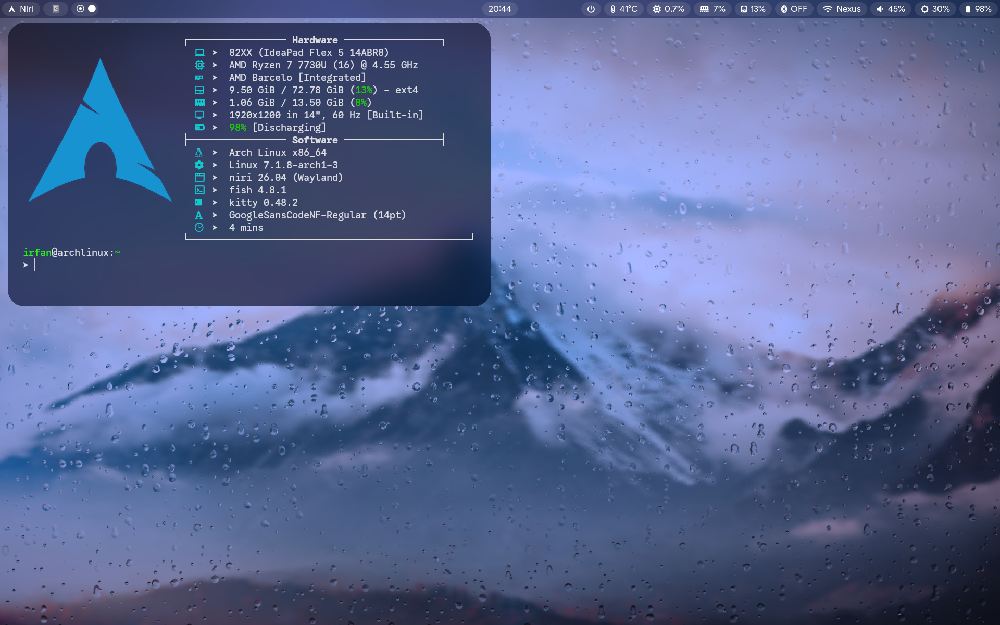
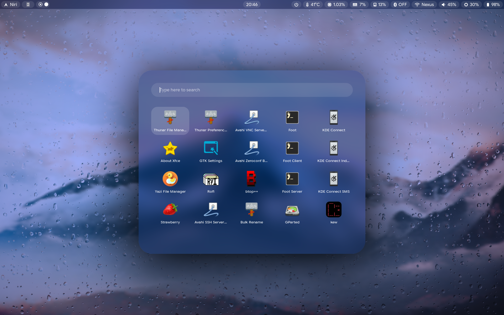
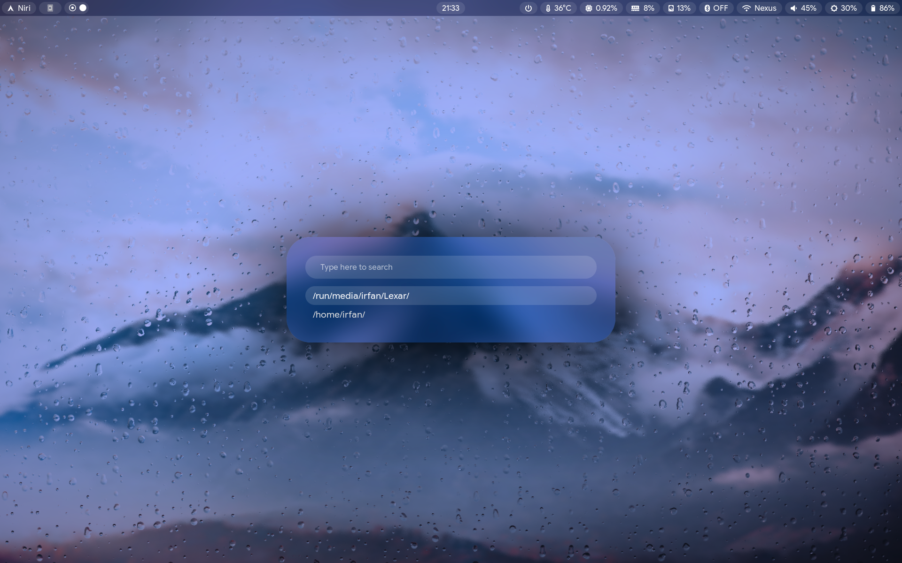
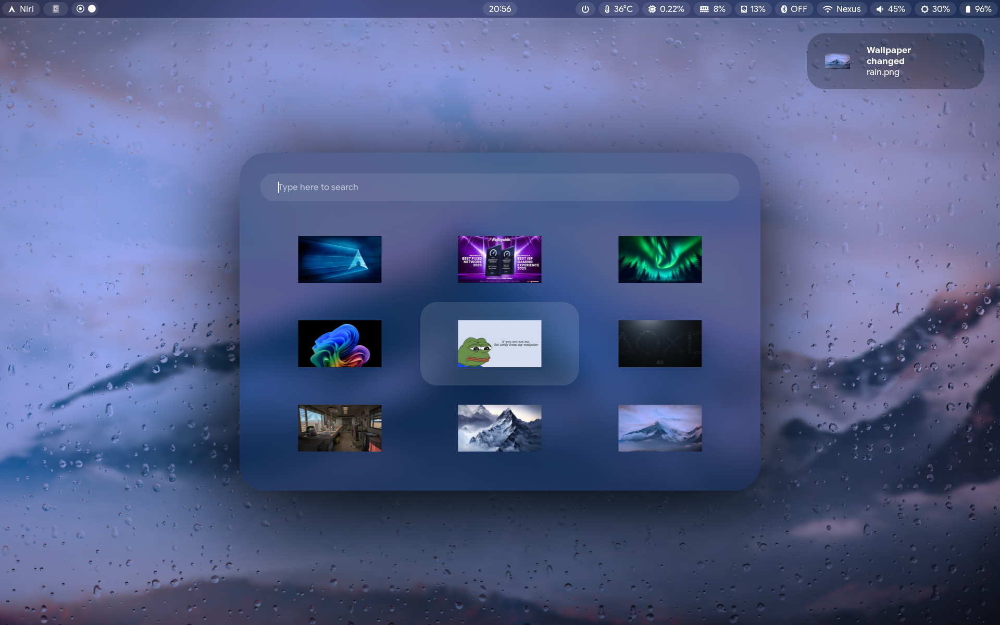
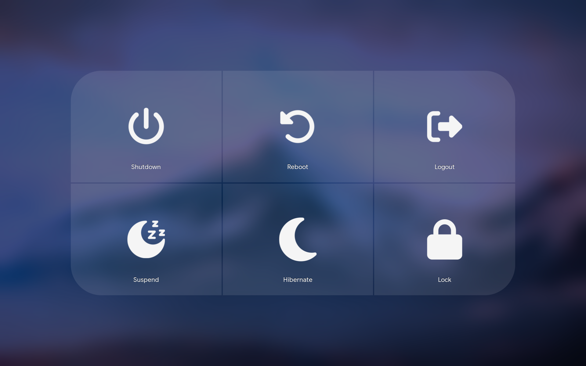

<div align="center">

# Dotfiles

**Arch Linux**


</div>

## [Niri](https://github.com/YaLTeR/niri)

> Scrollable-tiling Wayland compositor written in Rust with a unique window management approach.

## [Hyprland](https://github.com/hyprwm/Hyprland)

> Highly customizable and dynamic Wayland compositor focused on performance and aesthetics.

## [MangoWC](https://github.com/mangowm/mango)

> Lightweight Wayland compositor with fast builds and rich functionality.

## [DriftWM](https://github.com/malbiruk/driftwm)

> Trackpad-first Wayland compositor with an infinite canvas approach.

<br>

## Keybindings

> Consistent across all listed Wayland compositors. Check each compositor's config file for the full list.

| **Key Combination**                               | **Action**                 |
| :------------------------------------------------ | :------------------------- |
| <kbd>Super</kbd> + <kbd>T</kbd>                   | Open Terminal (`Kitty`)    |
| <kbd>Super</kbd> + <kbd>Space</kbd>               | Open App Launcher (`Rofi`) |
| <kbd>Super</kbd> + <kbd>Q</kbd>                   | Quit focused window        |
| <kbd>Super</kbd> + <kbd>B</kbd>                   | Open Browser (`Zen`)       |
| <kbd>Super</kbd> + <kbd>N</kbd>                   | Open File Manager (`Yazi`) |
| <kbd>Super</kbd> + <kbd>P</kbd>                   | Power Menu (`Wlogout`)     |
| <kbd>Super</kbd> + <kbd>Ctrl</kbd> + <kbd>E</kbd> | Exit Wayland compositor    |

<br>

|            **Desktop**             |
| :--------------------------------: |
|  |

|         **Launcher**          |
| :---------------------------: |
|  |

|          **Clipboard History**          |
| :-------------------------------------: |
|  |

|            **Wallpaper Picker**             |
| :-----------------------------------------: |
|  |

|           **Power Menu**            |
| :---------------------------------: |
|  |

<br>

## Installation

> [!IMPORTANT]
> Please review the [pkglist](Configs/installed-pkg/pkglist.txt) before executing install.sh so you have an idea of what will be installed. By default, you will get Niri and Hyprland, with Niri set as the default session.

> [!WARNING]
> The Installation script uses [GNU Stow](https://www.gnu.org/software/stow/) under the hood, so do **not** delete or move `~/dotfiles/`, otherwise all Stow-based symlinks will break.

### Prerequisites

- Arch Linux clean install (recommended) or an Arch-based distro

```bash
sudo pacman -Syu --needed --noconfirm git
```

```bash
cd ~ && git clone https://github.com/irfanihbro/dotfiles.git
```

```bash
bash ~/dotfiles/install.sh
```

### One-liner

```bash
sudo pacman -Syu --needed --noconfirm git && cd ~ && git clone https://github.com/irfanihbro/dotfiles.git && bash ~/dotfiles/install.sh
```

### Stow conflicts

If GNU Stow reports conflicts, use the helper directly:

```bash
bash ~/dotfiles/stow-configs.sh --dry-run
```

```bash
bash ~/dotfiles/stow-configs.sh --backup-conflicts
```

```bash
bash ~/dotfiles/stow-configs.sh --adopt
```

`--adopt` can overwrite existing files, so only use it when you intend to merge local state into the repo.

## Structure

<!-- TREE_START -->

```
Configs/
├── alacritty
│   └── alacritty.toml
├── bash
│   └── bashrc
├── bat
│   └── config
├── btop
│   ├── themes
│   └── btop.conf
├── cava
│   ├── shaders
│   │   ├── bar_spectrum.frag
│   │   ├── eye_of_phi.frag
│   │   ├── northern_lights.frag
│   │   ├── pass_through.vert
│   │   ├── spectrogram.frag
│   │   └── winamp_line_style_spectrum.frag
│   ├── themes
│   │   ├── solarized_dark
│   │   └── tricolor
│   └── config
├── driftwm
│   └── config.toml
├── fastfetch
│   ├── Arch.png
│   └── config.jsonc
├── fish
│   ├── completions
│   │   └── awww.fish
│   ├── functions
│   │   ├── cd.fish
│   │   ├── clean.fish
│   │   ├── fish_prompt.fish
│   │   ├── gacp.fish
│   │   ├── y.fish
│   │   └── ydl.fish
│   │   └── yt.fish
│   ├── config.fish
│   └── fish_variables
├── foot
│   ├── foot_for_cava.ini
│   ├── foot_for_smassh.ini
│   └── foot.ini
├── ghostty
│   └── config
├── gtk-3.0
│   └── settings.ini
├── gtk-4.0
│   └── settings.ini
├── hypr
│   ├── hyprland_modules
│   │   ├── Animations
│   │   │   └── Animations_End4.lua
│   │   ├── Autostart.lua
│   │   ├── Decorations.lua
│   │   ├── Generals.lua
│   │   ├── Gestures.lua
│   │   ├── Input.lua
│   │   ├── Keybinds.lua
│   │   ├── Layouts.lua
│   │   ├── Misc.lua
│   │   ├── Monitors.lua
│   │   └── Rules.lua
│   ├── hyprlock_themes
│   │   ├── hyprlock_1.conf
│   │   ├── hyprlock_2.conf
│   │   ├── hyprlock_3.conf
│   │   └── hyprlock_4.conf
│   └── hyprland.lua
│   └── sound-daemon.sh
├── installed-pkg
│   └── pkglist.txt
├── kdedefaults
│   ├── kcminputrc
│   ├── kdeglobals
│   ├── ksplashrc
│   ├── kwinrc
│   ├── package
│   └── plasmarc
├── kitty
│   └── kitty.conf
│   └── sound_watcher.py
├── klassy
│   ├── klassyrc
│   └── windecopresetsrc
├── mako
│   └── config
├── mango
│   ├── Modules
│   │   ├── Animations.conf
│   │   ├── Autostart.conf
│   │   ├── Blur.conf
│   │   ├── Dwindle_layout.conf
│   │   ├── Environments.conf
│   │   ├── General.conf
│   │   ├── Keybinds.conf
│   │   ├── Master-Stack.conf
│   │   ├── Monitors.conf
│   │   ├── Rules.conf
│   │   ├── Scroller_layout.conf
│   │   ├── Shadows.conf
│   │   └── Tagrules.conf
│   └── config.conf
├── mpv
│   ├── fonts
│   │   └── modernz-icons.ttf
│   ├── script-opts
│   │   ├── modernz.conf
│   │   └── modernz-locale.json
│   ├── scripts
│   │   └── modernz.lua
│   ├── input.conf
│   └── mpv.conf
├── niri
│   ├── Modules
│   │   ├── Animations.kdl
│   │   ├── Autostart.kdl
│   │   ├── Blur.kdl
│   │   ├── Cursor.kdl
│   │   ├── Input.kdl
│   │   ├── Keybinds.kdl
│   │   ├── Layout.kdl
│   │   ├── Others.kdl
│   │   ├── Outputs.kdl
│   │   ├── Overview.kdl
│   │   └── Rules.kdl
│   └── config.kdl
│   └── sound-daemon.sh
├── nvim
│   ├── lua
│   │   ├── configs
│   │   │   ├── conform.lua
│   │   │   ├── lazy.lua
│   │   │   └── lspconfig.lua
│   │   ├── plugins
│   │   │   └── init.lua
│   │   ├── autocmds.lua
│   │   ├── chadrc.lua
│   │   ├── mappings.lua
│   │   └── options.lua
│   ├── .stylua.toml
│   ├── init.lua
│   └── lazy-lock.json
├── quickshell
│   └── power_menu
│       └── shell.qml
├── Resources
│   ├── fonts
│   │   ├── Betterlett.ttf
│   │   ├── GoogleSansCodeNF-Bold.ttf
│   │   ├── GoogleSansCodeNF-Medium.ttf
│   │   ├── GoogleSansCodeNF-Regular.ttf
│   │   ├── GoogleSansFlex-VariableFont_GRAD,ROND,opsz,slnt,wdth,wght.ttf
│   │   ├── SF Pro Display Bold.otf
│   │   └── SF Pro Display Regular.otf
│   └── images
│       ├── PFP.jpg
│       └── red_dots.png
├── rofi
│   ├── clipboard.rasi
│   ├── config.rasi
│   ├── glass_minimal.rasi
│   ├── launchpad.rasi
│   └── wallpaper-selector.rasi
├── Scripts
│   ├── animation_switcher.sh
│   ├── auto_detect_terminal.sh
│   ├── bashfix.sh
│   ├── clipboard.sh
│   ├── clipboard_toggle.sh
│   ├── dashboard.sh
│   ├── dashboard_toggle.sh
│   ├── full_screenshot.sh
│   ├── kde-send.sh
│   ├── launcher.sh
│   ├── launcher_toggle.sh
│   ├── lockscr_greet.sh
│   ├── partial_screenshot.sh
│   ├── powermenu.sh
│   ├── powermenu_toggle.sh
│   ├── random_wall_on_home.sh
│   ├── random_wall_on_lockscr.sh
│   ├── rofi_clipboard.sh
│   ├── rofi_powermenu.sh
│   ├── screen_recorder.sh
│   ├── smassh.sh
│   ├── structure_update.py
│   ├── wallpaper_switcher.sh
│   ├── yazi_wall_setter.sh
│   └── ydl.py
├── smassh
│   └── smassh.json
├── swayimg
│   └── init.lua
├── swayidle
│   └── config-hyprland
│   └── config-niri
├── systemd
│   └── user
│       ├── default.target.wants
│       │   └── niri.service -> /home/irfan/.config/systemd/user/niri.service
│       └── niri.service
├── waybar
│   ├── DriftWM
│   │   ├── config.jsonc
│   │   └── style.css
│   ├── Hyprland
│   │   └── config.jsonc
│   ├── MangoWM
│   │   └── config.jsonc
│   ├── Modules
│   │   ├── Backlight.jsonc
│   │   ├── Battery.jsonc
│   │   ├── Bluetooth.jsonc
│   │   ├── Center.jsonc
│   │   ├── Clock.jsonc
│   │   ├── Cpu.jsonc
│   │   ├── Disk.jsonc
│   │   ├── Memory.jsonc
│   │   ├── Mpris.jsonc
│   │   ├── Network.jsonc
│   │   ├── Power.jsonc
│   │   ├── Pulseaudio.jsonc
│   │   ├── Right.jsonc
│   │   ├── Temperature.jsonc
│   │   └── Tray.jsonc
│   ├── Niri
│   │   └── config.jsonc
│   └── style.css
├── wezterm
│   └── wezterm.lua
├── wlogout
│   ├── icons
│   │   ├── hibernate.png
│   │   ├── lock.png
│   │   ├── logout.png
│   │   ├── power.png
│   │   ├── restart.png
│   │   └── sleep.png
│   ├── layout
│   └── style.css
├── xsettingsd
│   └── xsettingsd.conf
└── yazi
    ├── flavors
    │   └── dracula.yazi
    │       ├── flavor.toml
    │       ├── LICENSE
    │       ├── LICENSE-tmtheme
    │       ├── preview.png
    │       ├── README.md
    │       └── tmtheme.xml
    ├── plugins
    │   └── full-border.yazi
    │       ├── LICENSE
    │       ├── main.lua
    │       └── README.md
    ├── init.lua
    ├── keymap.toml
    ├── package.toml
    ├── theme.toml
    └── yazi.toml
```

<!-- TREE_END -->

# Credits

Originally created by:
[BlackSparkz](https://github.com/BlackSparkz)

This fork contains additional modifications:

- Fixed Overview wallpaper not showing in startup
- Added sound effects on window open/close
- Added fade effect for wlogout
- Added additional packages to be installed
- Fixed random wallpaper logic

Modified by:
[irfanihbro](https://github.com/irfanihbro) (me)
